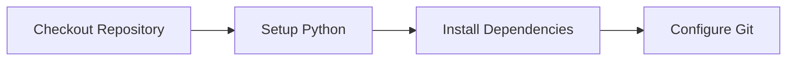
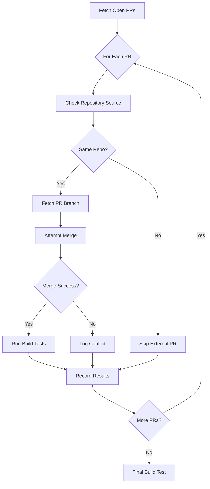

# Automated PR Merge and Build Testing Workflow

## Overview

The **Automated PR Merge and Build Testing** workflow provides a comprehensive solution for testing the integration of all open pull requests without affecting the main branch. This workflow creates a temporary test branch, merges all open PRs sequentially, and runs build validation after each merge.

## Features

### [SYNC] **Automated PR Processing**
- Discovers all open pull requests automatically
- Creates isolated test branches for safe testing
- Merges PRs sequentially to identify integration issues
- Handles merge conflicts gracefully without interruption

### ️ **Comprehensive Build Testing**
- Runs CTMM build system validation after each merge
- Executes LaTeX syntax validation
- Performs enhanced build management checks
- Attempts full PDF generation for final validation

### [SUMMARY] **Detailed Reporting**
- Generates comprehensive test result summaries
- Tracks successful and failed merges/builds
- Provides individual PR analysis logs
- Creates actionable recommendations for manual review

### [SECURE] **Safe Operation**
- Never modifies the main branch directly
- Works only on temporary test branches
- Includes automatic cleanup after completion
- Handles external repository PRs safely

## Usage

### Manual Execution

The workflow can be triggered manually through GitHub Actions:

1. Go to **Actions** tab in the repository
2. Select **Automated PR Merge and Build Testing**
3. Click **Run workflow**
4. Configure options:
  - **Base branch**: Branch to merge PRs into (default: `main`)
  - **Max PRs**: Maximum number of PRs to test (default: `10`)
  - **Cleanup branch**: Delete test branch after completion (default: `true`)

### Scheduled Execution

The workflow automatically runs:
- **Weekly on Sundays at 2 AM UTC**
- Processes all open PRs with default settings

### Input Parameters

| Parameter | Description | Default | Type |
|-----------|-------------|---------|------|
| `base_branch` | Base branch to merge PRs into | `main` | string |
| `max_prs` | Maximum number of PRs to test (0 = all) | `10` | string |
| `cleanup_branch` | Delete test branch after completion | `true` | boolean |

## Workflow Process

### 1. **Initialization**


### 2. **Test Branch Creation**
- Creates uniquely named test branch: `automated-merge-test-YYYYMMDD-HHMMSS`
- Based on specified base branch (default: `main`)
- Pushes test branch to remote repository

### 3. **PR Discovery and Processing**


### 4. **Build Testing Sequence**

For each successfully merged PR:
1. **CTMM Build System Check** (`ctmm_build.py`)
2. **LaTeX Syntax Validation** (`validate_latex_syntax.py`)
3. **Result Logging** (individual PR logs)

After all PR processing:
1. **Final Combined Build Test**
2. **Enhanced Build Management**
3. **PDF Generation Attempt** (with LaTeX)
4. **Comprehensive Result Summary**

### 5. **Results and Cleanup**
- Uploads all test results as GitHub Actions artifacts
- Generates markdown summary with statistics
- Cleans up test branch (if enabled)
- Creates actionable recommendations

## Output Artifacts

### Test Results Structure
```
test_results/
├── summary.md  # Main summary report
├── pr_XXX_build.log  # Individual PR build logs
├── pr_XXX_merge.log  # Individual PR merge logs
├── pr_XXX_merge_conflicts.log  # Merge conflict details
├── final_ctmm_build.log  # Final CTMM build log
├── final_latex_validation.log  # Final LaTeX validation log
├── final_enhanced_build.log  # Final enhanced build log
├── latex_error.log  # LaTeX compilation errors
├── combined_test.pdf  # Generated PDF (if successful)
├── successful_merges.count  # Success counters
├── failed_merges.count  # Failure counters
├── successful_builds.count  # Build success counters
└── failed_builds.count  # Build failure counters
```

### Summary Report Example

```markdown
# Automated PR Merge and Build Test Results

**Test Branch:** automated-merge-test-20240818-140532
**Base Branch:** main
**Timestamp:** 2024-08-18 14:05:32 UTC
**Total PRs Found:** 5

## Individual PR Test Results

### PR #123: Fix LaTeX escaping issues
- **Head SHA:** abc123...
- **Head Ref:** fix-escaping
- **Repository:** Darkness308/CTMM---PDF-in-LaTex
- **Merge Status:** [PASS] SUCCESS
- **Build Status:** [PASS] SUCCESS

### PR #124: Add new therapy module
- **Head SHA:** def456...
- **Head Ref:** new-module
- **Repository:** Darkness308/CTMM---PDF-in-LaTex
- **Merge Status:** [FAIL] FAILED (merge conflicts)
- **Build Status:** ️ SKIPPED (merge failed)

## Final Combined Build Results
- **Final Build Status:** [PASS] SUCCESS
- **PDF Generation:** [PASS] SUCCESS

## Summary Statistics
| Metric | Count |
|--------|-------|
| Total PRs Found | 5 |
| Successful Merges | 4 |
| Failed Merges | 1 |
| Successful Builds | 4 |
| Failed Builds | 0 |

## Recommendations for Manual Review
- [SEARCH] **Review merge conflicts:** 1 PR(s) failed to merge
- [PASS] **Integration ready:** All successfully merged PRs passed build validation
- [TEST] **Next steps:** Review individual PR logs for detailed failure analysis
```

## Integration with Existing Tools

### Reuses Established Components
- **CTMM Build System** (`ctmm_build.py`)
- **LaTeX Validation** (`validate_latex_syntax.py`)  
- **LaTeX Action** (`dante-ev/latex-action@v2.0.0`)
- **Artifact Upload** (GitHub Actions built-in)

### Extends Current Workflows
- Compatible with existing CI/CD pipelines
- Does not interfere with PR validation workflows
- Uses same LaTeX packages and dependencies
- Follows established error handling patterns

## Security Considerations

### Safe Operations
- [PASS] **Isolated Testing**: Works only on temporary test branches
- [PASS] **No Main Branch Modification**: Never touches main branch directly
- [PASS] **Token Security**: Uses GitHub's built-in authentication
- [PASS] **External PR Handling**: Safely skips external repository PRs
- [PASS] **Automatic Cleanup**: Removes test branches after completion

### Branch Protection
- Test branches are created with unique timestamps
- All operations are logged and traceable
- Failed operations don't affect repository state
- Merge conflicts are handled without data loss

## Troubleshooting

### Common Issues

**No PRs Found**
- Check if there are actually open PRs in the repository
- Verify the `max_prs` parameter isn't set too low
- Ensure GitHub token has repository read permissions

**Merge Conflicts**
- Review individual PR merge logs for conflict details
- Consider rebasing conflicting PRs manually
- Check if PRs are based on outdated branches

**Build Failures**
- Review individual PR build logs for error details
- Verify PRs don't introduce LaTeX syntax errors
- Check if PRs break CTMM build system requirements

**External Repository PRs**
- External PRs are automatically skipped for security
- This is expected behavior, not an error
- Manual testing required for external contributions

### Log Analysis

**Merge Logs** (`pr_XXX_merge.log`)
```bash
# View merge attempt details
cat test_results/pr_123_merge.log
```

**Build Logs** (`pr_XXX_build.log`)
```bash
# View build validation output
cat test_results/pr_123_build.log
```

**Conflict Logs** (`pr_XXX_merge_conflicts.log`)
```bash
# View merge conflict details
cat test_results/pr_123_merge_conflicts.log
```

## Maintenance

### Workflow Updates
- Workflow configuration in `.github/workflows/automated-pr-merge-test.yml`
- Validation script: `test_automated_pr_workflow.py`
- Regular testing ensures continued compatibility

### Performance Tuning
- Adjust `max_prs` parameter for large repositories
- Modify cron schedule for different testing frequencies
- Configure cleanup behavior based on storage needs

### Monitoring
- Review GitHub Actions usage for resource consumption
- Monitor artifact storage for large result sets
- Track workflow success rates over time

## Contributing

### Workflow Modifications
1. Update workflow YAML file
2. Run validation: `python3 test_automated_pr_workflow.py`
3. Test manually with small PR set
4. Document changes in this file

### Adding New Validation Steps
1. Add build commands to appropriate workflow steps
2. Update result logging and summary generation
3. Test with various PR scenarios
4. Update troubleshooting documentation

---

**Workflow File**: `.github/workflows/automated-pr-merge-test.yml`  
**Validation Script**: `test_automated_pr_workflow.py`  
**Documentation**: This file (`AUTOMATED_PR_MERGE_WORKFLOW.md`)